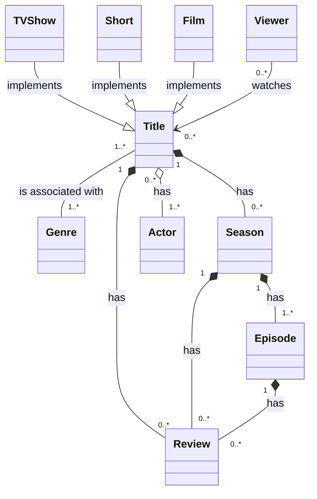
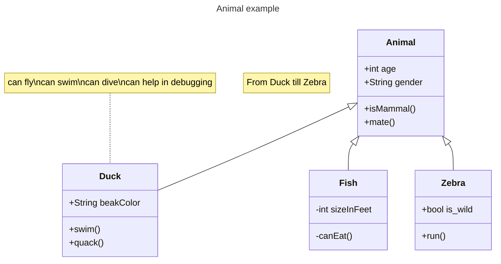

# Class Diagram

## From Book

```mermaid
classDiagram
    Title "1..*" -- "1..*" Genre: is associated with
    Title "1" *-- "0..*" Season: has
    Title "1" *-- "0..*" Review: has
    Title "0..*" o--  "1..*" Actor: has
    TV Show --|> Title: implements
    Short --|> Title: implements
    Film --|> Title: implements
    Viewer "0..*" --> "0..*" Title: watches
    Season "1" *-- "0..*" Review: has
    Season "1" *-- "1..*" Episode: has
    Episode "1" *-- "0..*" Review: has

```

## From Documentation

```mermaid
---
title: Animal example
---
classDiagram
    note "From Duck till Zebra"
    Animal <|-- Duck
    note for Duck "can fly\ncan swim\ncan dive\ncan help in debugging"
    Animal <|-- Fish
    Animal <|-- Zebra
    Animal : +int age
    Animal : +String gender
    Animal: +isMammal()
    Animal: +mate()
    class Duck{
        +String beakColor
        +swim()
        +quack()
    }
    class Fish{
        -int sizeInFeet
        -canEat()
    }
    class Zebra{
        +bool is_wild
        +run()
    }
```

## Annotations
